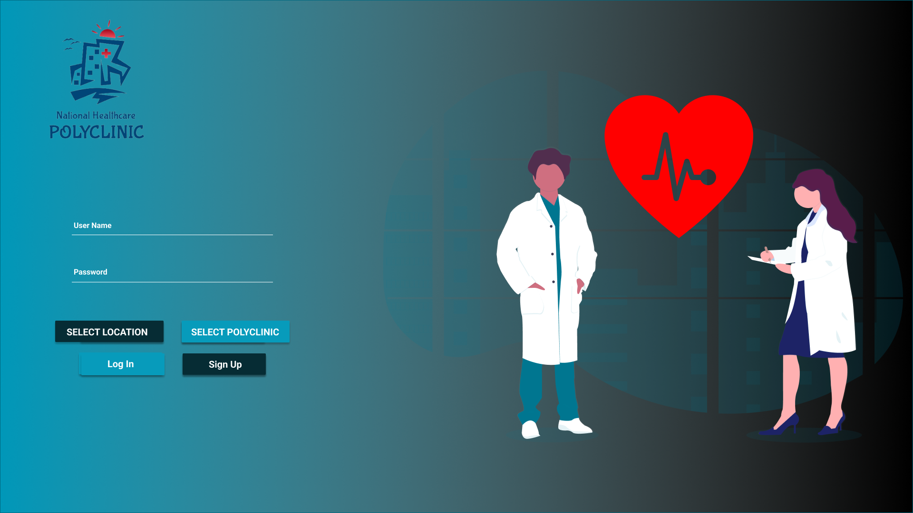

# Polyclinic-Management-System

   Our project consists of a Web-based application for a Polyclinic Management System. This Webpage will give access to all polyclinics in Albania, but the doctors, nurses, receptionists have to choose the polyclinic where they work.   
    Some features that we can mention are: leaving appointments, patient registration, keeping medical records for each patient in a digital form instead of on paper, create a safe Webpage, sign online prescriptions,   every patient needs to have a profile picture at their records,   etc .   
    The implementation of the idea will work closely with polyclinics by having access at their actual webpage application and some doctors that we have close relations to. Polyclinic’s doctors will be the one to leave appointments for their patients depending on the polyclinics doctor’s timetable and also share the medical records of the patient with that doctor. 

